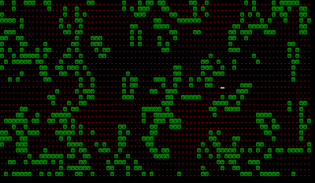

#Conway's Game of Life CLI in Javascript

Uses Charm to render to console.

Clone the repo and npm install in the directory to grab Charm from npm.

node app.js

Sets grid size to console width and height.  If rendering is slow shrink down the console window and rerun.

TODO: Check out other algs for testing cells
